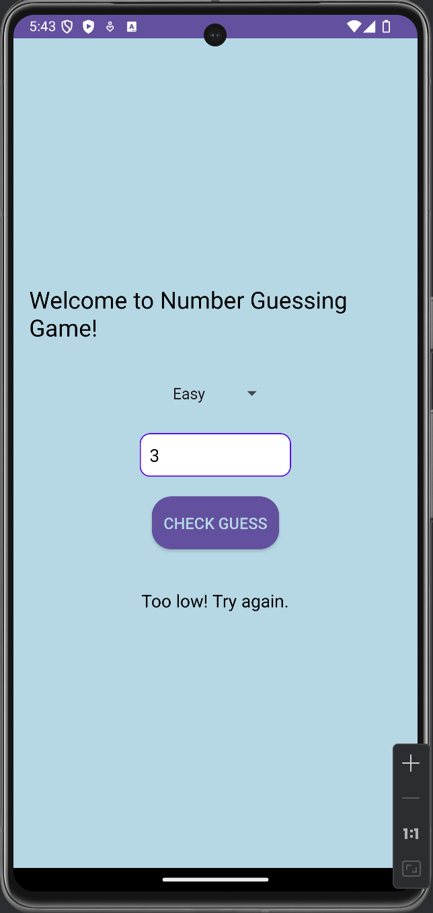
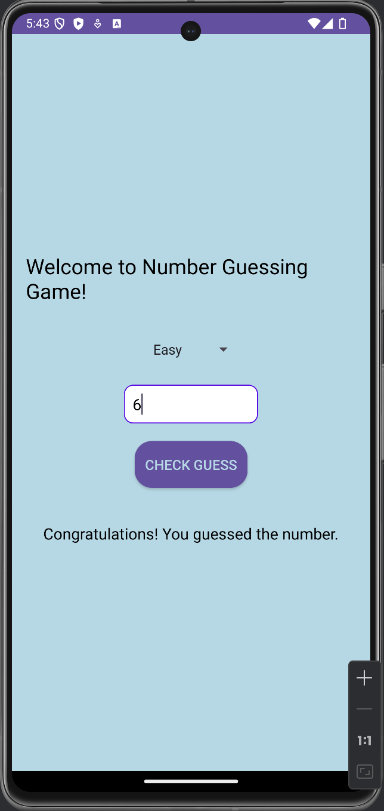

# Number Guessing Game

Welcome to the Number Guessing Game! This is a simple and fun Android game developed in Kotlin where the user has to guess a randomly generated number within a certain range.


## Table of Contents:

- [Features](#Features)
- [Screenshots](#Screenshots)
- [Installation](#Installation)
- [Usage](#Usage)
  
### Features

- User-friendly interface
-  Random number generation
-  Customizable number range
-  Simple and easy to play

### Screenshots






## Installation

To run this project, follow these steps:

1. Clone the repository:

    ```sh
    git clone https://github.com/Shams261/numberguessinggame.git
    ```

2. Open the project in Android Studio.

3. Build the project and run it on an emulator or a physical device.

## Usage

1. Open the app.
2. Enter your guess in the input field.
3. Click the "Guess" button.
4. If it is correct, you will see the message pf congrats else wil show too high or too low.
5. Hollaa that's it , play and enjoy 

